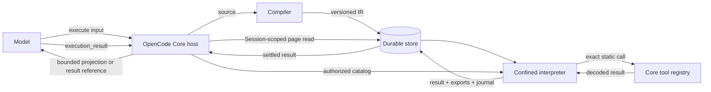
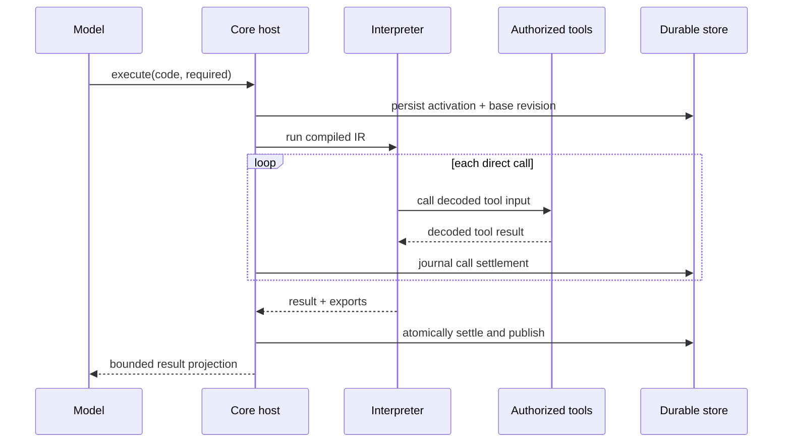
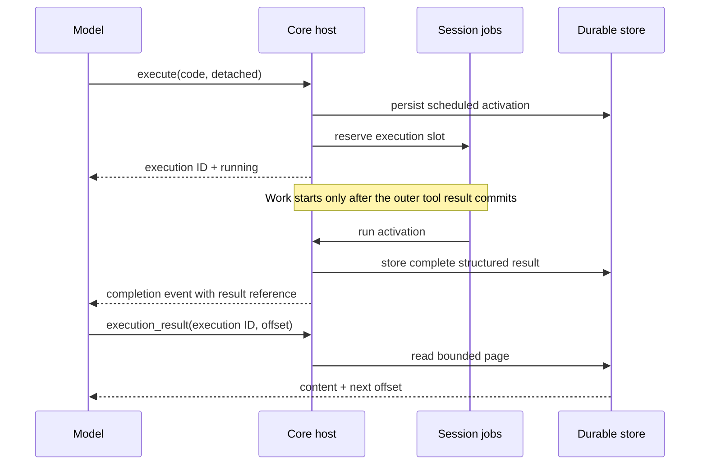

# Code Mode: Compiled Durable Activations

This fork redesigns Code Mode as a compiled, immutable activation language backed by durable Core state. It replaces the earlier Promise-oriented evaluator and background-output delivery model.

The implementation has two deliberate layers:

- `@opencode-ai/codemode` compiles and evaluates a restricted JavaScript-shaped language over an explicit catalog of schema-described tools. It has no Session, database, authorization, or delivery knowledge.
- OpenCode Core supplies the authorized tool catalog, execution limits, durable notebook and result storage, Session lifecycle integration, detached Jobs, and model-facing delivery.



The interpreter never reaches around the tool registry. Filesystem, network, process, and application effects are available only when the host exposes a named tool that performs them.

## Feature Summary

| Feature              | Behavior                                                                                                   |
| -------------------- | ---------------------------------------------------------------------------------------------------------- |
| Compiled activations | Source is transpiled, parsed, validated, and stored as versioned IR before execution.                      |
| Blocking tool calls  | `tools.repository.read(input)` returns its decoded result directly. Promise syntax is not used.            |
| Immutable data       | `const`, notebook bindings, arrays, objects, Maps, Sets, Dates, and URLs cannot be mutated.                |
| Local working state  | `let` supports activation-local scalar updates, including updates from synchronous closures and callbacks. |
| Durable notebook     | Direct top-level `export const` declarations publish JSON-like values transactionally.                     |
| Required execution   | The default mode waits for completion and returns a bounded result projection.                             |
| Detached execution   | Returns an execution ID immediately and later delivers only a durable result reference.                    |
| Result retrieval     | `execution_result` reads the structured durable result in UTF-8-safe pages.                                |
| Scoped delegation    | `tool.define` creates same-activation opaque tool handles with frozen captures and enforced capabilities.  |
| Durable lifecycle    | Activations, call journals, results, bindings, fork history, and revert state are persisted by Core.       |
| Bounded delivery     | Results, logs, captures, progress, projections, and pages have explicit byte limits.                       |
| Session UI           | The timeline renders source, progress events, terminal status, and bounded execution details.              |

## Quick Start

Tool paths are catalog-dependent. The examples below use an illustrative `repository` namespace; use `search` to find
the paths and schemas exposed by the current host. An activation calls those exact static paths and composes returned
values synchronously:

```ts
const matches = tools.repository.glob({ pattern: "src/**/*.ts" })
const files = matches.slice(0, 20).map((item) => tools.repository.read({ path: item.path }))
const totalLines = files.reduce((total, file) => total + file.content.split("\n").length, 0)

export const lastScan = { files: matches.length, totalLines }
return lastScan
```

The activation result is the value from:

1. An explicit top-level `return`.
2. The final top-level expression when no explicit return is present.
3. `null` when neither produces a value.

Tool schemas are the callable interface. Inputs, results, exports, tool arguments, and tool outputs cross bounded JSON-like copy boundaries.

If the exact catalog path or signature is unknown, discover it synchronously and then call the returned static path in a later activation:

```ts
return search({ query: "read file", namespace: "repository" })
```

Do not assign a discovered path to a variable and invoke it dynamically. Dynamic dispatch is intentionally rejected.

## Execution Modes

The Core `execute` tool accepts:

```ts
{
  code: string
  mode?: "required" | "detached"
  timeoutMs?: number
}
```

### Required

Required mode is the default. The tool call waits for the activation to settle, stores the complete structured result, and returns:

- The execution ID.
- Terminal status.
- Durable result byte count.
- A bounded, explicitly untrusted head-and-tail projection of the structured result.

Failures remain typed and model-visible. A required failure fails the outer tool call while preserving its durable result for later inspection.

Example host-tool input:

```ts
{
  code: `const matches = tools.repository.grep({
  pattern: "TODO|FIXME",
  path: "src",
  include: "*.ts",
})

const byFile = Object.groupBy(matches, (match) => match.entry.path)
return Object.entries(byFile).map(([path, items]) => ({
  path,
  count: items.length,
}))`,
  mode: "required",
  timeoutMs: 30_000,
}
```



### Detached

Detached mode reserves a per-Session Job and returns an execution ID with `running` status. Execution starts only after the outer tool result commits, preventing detached side effects from racing ahead of tool-call settlement.

When detached work settles:

- The full structured result remains in durable result storage.
- Session completion and failure events contain status, progress events, and the execution ID, not the full output.
- The synthetic notification contains only a trusted result reference.
- The model retrieves data explicitly with `execution_result`.

At most four detached Code Mode executions may run concurrently per Session. Rejected admission removes the still-scheduled activation so it does not consume recovery or result state.



## Durable Results And Paging

Every settled activation has one structured result keyed by execution ID. The result includes the success value or diagnostic, tool calls, warnings, logs, exports, and truncation state when applicable.

`execution_result` accepts an execution ID, byte offset, and optional page limit. It:

- Verifies that the execution belongs to the calling Session.
- Serializes the stored structured result consistently.
- Returns at most 16 KiB per page.
- Aligns page boundaries to UTF-8 code points.
- Returns a `next` offset until the complete result has been read.
- Frames content as untrusted execution data and neutralizes framing markers and angle brackets.

Large data is retained up to the durable result limit instead of being destroyed merely to fit model context. Normal delivery remains small; explicit retrieval pays the context cost only when needed.

Retrieve every page by carrying `next` forward:

```ts
// First call to the host tool
{ executionID: "exe_01...", offset: 0, limit: 16_384 }

// Response
{
  executionID: "exe_01...",
  status: "completed",
  offset: 0,
  totalBytes: 28_731,
  next: 16_384,
  content: "{\"ok\":true,...",
}

// Continue from the returned offset
{ executionID: "exe_01...", offset: 16_384, limit: 16_384 }
```

Stop when `next` is `null`. The content is a page of one serialized structured result, so concatenate pages by byte order before parsing when machine reconstruction is required.

## Durable Notebook And Publication

Each Session owns a durable Code Mode notebook. Starting an activation snapshots:

- Current immutable notebook bindings.
- The notebook base revision.
- Compiled versioned IR.
- Session, assistant-message, and tool-call identity.
- Required or detached delivery mode.

Publication uses direct top-level declarations:

```ts
export const selectedFiles = ["src/a.ts", "src/b.ts"]
export const summary = { count: selectedFiles.length }
```

Publication is all-or-fail:

- Only unconditional direct top-level `export const name = value` declarations are accepted.
- Every exported value must be valid JSON-like data.
- All exports commit in one transaction.
- The notebook revision must still equal the activation base revision.
- A stale activation receives `RevisionConflict` and publishes nothing.
- Missing or reverted assistant-message ownership also becomes a durable revision conflict instead of an unsettled defect.

Default exports, re-exports, exported functions, exported `let`, destructured exports, and conditional exports are rejected.

Concurrent activations use optimistic revisions:

```mermaid
sequenceDiagram
    participant A as Activation A
    participant B as Activation B
    participant N as Notebook

    N-->>A: bindings at revision 7
    N-->>B: bindings at revision 7
    B->>N: publish summary
    N-->>B: committed revision 8
    A->>N: publish selectedFiles at base 7
    N-->>A: RevisionConflict; nothing published
```

The conflict is intentional. A stale activation may still have valid execution output, but it cannot overwrite notebook state derived from newer work. Rerun it against the current bindings when publication is still wanted.

## Fork, Revert, And Restart Semantics

Binding history records publication revision and assistant-message sequence. This lets Session history operations preserve notebook meaning:

- A fork copies binding history through the copied assistant-message sequence and rebuilds the child notebook from the newest included values.
- A committed revert removes history at and after its message boundary and rebuilds current bindings from retained history.
- Notebook revisions remain monotonic across revert, preventing an old activation from matching a reused revision number.
- Reusing a Session continues its existing notebook rather than creating an unrelated one.

Notebook state and settled results survive process restart. In-flight activations and scheduled tool calls are not replayed automatically because arbitrary tool side effects are not idempotent. Startup recovery marks unsettled activations, calls, and results `indeterminate`, making uncertainty explicit and retrievable.

## Activation Language

### Supported

- Erasable TypeScript syntax that transpiles to supported JavaScript.
- JSON-like literals, template literals, and regular-expression literals.
- Object and array spread and destructuring.
- Synchronous function declarations, function expressions, arrow functions, closures, recursion, parameters, and callbacks.
- Blocks, `if`, `switch`, `for`, `for...of`, `for...in`, `while`, and `do...while`.
- `break`, `continue`, labels, `try`, `catch`, `finally`, and `throw`.
- Arithmetic, comparison, logical, nullish, bitwise, and conditional expressions.
- Assignment to activation-local scalar `let` bindings.
- Optional chaining and property reads.
- Non-mutating Array, Object, String, Number, Math, JSON, Date, RegExp, Map, Set, URL, and URLSearchParams operations implemented by the evaluator.
- Captured `console.log`, `console.info`, `console.warn`, `console.error`, `console.dir`, and `console.table` output.
- Literal bracket notation for tool path segments that are not JavaScript identifiers.
- Synchronous `search(input)` for bounded catalog discovery. Search counts as a tool call.

### Rejected

- `Promise`, `async`, `await`, generators, `yield`, and `for await...of`.
- Dynamic tool dispatch such as `tools[name](input)`.
- Detached tool references and enumeration of tool namespaces.
- Imports, dynamic imports, re-exports, and ambient modules.
- `var`.
- Member assignment, member updates, `delete`, destructuring into members, and loop assignment into members.
- Mutating Array, Object, Date, Map, Set, URL, and URLSearchParams methods.
- Classes and evaluator syntax not explicitly implemented.
- Ambient filesystem, process, network, timer, `fetch`, module-loading, or cryptographic authority.

The compiler catches unsupported forms before execution. Runtime checks provide a second boundary for computed mutator names and evaluator references.

## Immutability Model

`let` exists for scalar control state:

```ts
let total = (0)[(1, 2, 3)].forEach((value) => {
  total += value
})
return total
```

Aggregate values are immutable. Derive replacements with `map`, `filter`, `slice`, spread, and object literals:

```ts
const original = [1, 2, 3]
const updated = [...original, 4]
return updated.map((value) => value * 2)
```

Notebook bindings are immutable even when their underlying values are arrays or objects. Compiler validation rejects assignment targets hidden in destructuring and loop forms so host-provided values cannot be mutated by reference.

## Opaque Tool Handles

`tool.define` creates a delegated tool that exists only for the current activation:

```ts
const inspect = tool.define({
  name: "inspect",
  description: "Read one source file and return numbered matching lines",
  inputSchema: {
    type: "object",
    properties: {
      path: { type: "string" },
      pattern: { type: "string" },
    },
    required: ["path", "pattern"],
  },
  outputSchema: {
    type: "array",
    items: {
      type: "object",
      properties: {
        line: { type: "number" },
        text: { type: "string" },
      },
      required: ["line", "text"],
    },
  },
  execute: (input) => {
    const file = tools.repository.read({ path: input.path })
    const expression = new RegExp(input.pattern, "i")
    return file.content
      .split("\n")
      .map((text, index) => ({ line: index + 1, text }))
      .filter((item) => expression.test(item.text))
  },
})

return tools.subagent({
  agent: "build",
  description: "Review error handling",
  prompt: "Use inspect to find error-handling branches in src/worker.ts, then explain the gaps.",
  tools: [inspect],
  outputSchema: {
    type: "object",
    properties: {
      summary: { type: "string" },
      riskyLines: { type: "array", items: { type: "number" } },
    },
    required: ["summary", "riskyLines"],
  },
})
```

Of the parent activation's catalog, the subagent receives only the delegated `inspect` handle; it may still have tools configured independently for its own agent. The handle itself may call only `tools.repository.read`, because that direct static call is the capability derived by the compiler.

Handle guarantees:

- Captured bindings are snapshotted at definition time and made immutable.
- Capture discovery follows nested functions through objects, symbol properties, arrays, Maps, and Sets.
- Direct static tool calls in the execute function become enforced capabilities.
- Calls hidden behind captured helper functions are rejected because they are not declared capabilities.
- The handle uses the outer activation's filtered catalog, authorization, counters, hooks, and deadline.
- Only host tools with `acceptsToolHandles: true` may receive handles.
- Handles are opaque, are not JSON data, cannot be exported or persisted, and become inactive when the activation settles.
- Handles created in nested function invocations share the activation lifetime and are closed with top-level handles.

## Limits

OpenCode Core applies these hosted activation limits:

| Resource                                   |       Limit |
| ------------------------------------------ | ----------: |
| Wall-clock execution                       | 120 seconds |
| Tool calls                                 |         100 |
| Durable structured result                  |       1 MiB |
| Captured journal input or output           |     256 KiB |
| Captured logs                              |     256 KiB |
| Model-facing projection                    |      16 KiB |
| Result page                                |      16 KiB |
| Concurrent detached executions per Session |           4 |

The deadline includes in-flight tool calls. Timeout interrupts the tool fiber and waits for interruption cleanup before settlement. A caller may request a shorter positive timeout, but not one above 120 seconds.

The standalone `@opencode-ai/codemode` package remains host-neutral. It applies only limits supplied by its host; Core provides the production defaults above.

## Diagnostics

Compilation, execution, host tools, publication, and recovery return structured diagnostics. Stable categories include:

- Parse and unsupported-syntax failures.
- Unknown tools and invalid tool input or output.
- Invalid data values.
- Tool-call limit exhaustion.
- Timeout.
- Tool refusal or failure.
- Execution failure.
- Notebook revision conflict.
- Truncation.

Compiler diagnostics include source locations when available and recommend direct blocking calls and immutable transformations rather than legacy Promise syntax. Host failures preserve their useful messages while interruption remains interruption rather than a generic failure.

## Authorization And Trust Boundaries

Code Mode does not invent a second permission system. The host controls authority by:

1. Exposing only tools available to the current request.
2. Running normal domain authorization inside each tool.
3. Marking the few tools allowed to receive opaque handles.
4. Applying the same hooks and permission flow used by native tool calls.

The evaluator has no ambient process, filesystem, network, timer, or module authority. All external effects must cross a named host tool boundary.

Tool output and execution results are untrusted data, not instructions. Model projections and result pages use explicit framing and neutralize spoofable markers and tags. Detached notifications never embed the full result.

## Session UI

Session UI recognizes Code Mode lifecycle metadata and renders the production timeline components for:

- Submitted activation source with syntax highlighting.
- Running tool and trace events.
- Required and detached status.
- Completed, failed, cancelled, and indeterminate outcomes.
- Result byte counts and retrieval guidance when output is truncated or detached.

The UI consumes bounded progress metadata. Full durable data remains behind `execution_result` instead of being duplicated into every event, assistant metadata record, and synthetic message.

## Compatibility

This design is intentionally incompatible with the earlier Promise-oriented Code Mode runtime. Existing programs must be updated as follows:

```ts
// Earlier runtime
const results = await Promise.all(paths.map((path) => tools.repository.read({ path })))

// Compiled activation runtime
const results = paths.map((path) => tools.repository.read({ path }))
```

Other important changes:

- Tool calls return values directly.
- Required mode is now the default.
- Detached work is explicit.
- Full detached output is retrieved by execution ID.
- Aggregate mutation is rejected.
- Only direct top-level `export const` declarations publish notebook state.
- In-flight work interrupted by restart becomes indeterminate and is not automatically replayed.

## Implementation Map

- `src/compiler.ts`: transpilation, versioned IR, and incompatible-syntax validation.
- `src/interpreter/execute.ts`: execution deadline and output/log budgets.
- `src/interpreter/runtime.ts`: evaluator, immutability, closures, handles, and capability enforcement.
- `src/tool-runtime.ts`: schema boundaries, catalog lookup, call accounting, and host hooks.
- `../core/src/codemode/store.ts`: durable activations, journals, results, bindings, paging, fork, revert, and recovery settlement.
- `../core/src/codemode/tool.ts`: required/detached hosting, progress, untrusted projections, Jobs, and `execution_result`.
- `../session-ui/src/tools/tool-renderer.tsx`: Session timeline rendering.

Direct contract tests live in `test/activation.test.ts`, with durable lifecycle integration tests in Core's `test/codemode-store.test.ts`, `test/tool-execute.test.ts`, and `test/tool-registry.test.ts`.
